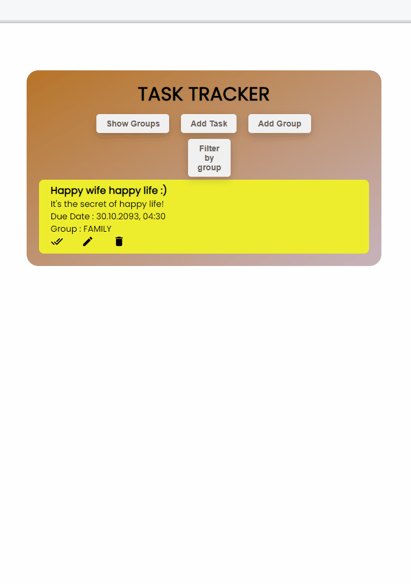

# **Todo Task**

## **Description**

This project is a ToDo Application. It consists of two main components: a backend and a frontend, designed to track the tasks. The backend is built using Django, while the frontend is developed with React.

## **Project Skeleton**
```
backend:
    db.sqlite3:                      SQLite database file.
    dockerfile:                      Configuration file for Docker containers.
    main:
        __init__.py:                 Initial file for the Python package.
        asgi.py:                     Entry file for ASGI application.
        settings.py:                 Django project settings.
        urls.py:                     Django URL configurations.
        wsgi.py:                     Entry file for WSGI application.
    manage.py:                       Main file for Django project management commands.
    requirements.txt:                List of Python packages used in the project.
    todo:
        __init__.py:                 Initial file for the "todo" application.
        admin.py:                    Django admin panel configuration.
        apps.py:                     Application configuration.
        migrations:
            0001_initial.py:         Initial database migration.
            __init__.py:             Initial file for migrations.
        models.py:                   Database models.
        serializers.py:              Django REST framework serializers.
        tests.py:                    Application tests.
        urls.py:                     Application URL configurations.
        views.py:                    View functions.

frontend:
    dockerfile:                      Configuration file for Docker containers.
    package-lock.json:               Files containing Node.js package information and 
    package.json:                    dependencies.       
    public:
        index.html:                  The main HTML entry file for the application.
        src:
            App.css:                 Application styling.
            App.js:                  Main application component.
            components:
                AddTask.jsx:         Task addition component.
                EditItemForm.jsx:    Item editing form.
                ShowGroups.jsx:      Component for displaying groups.
                ShowTasks.jsx:       Component for displaying tasks.
            helper:
                ToastNotify.js:      Helper function for displaying notifications.
            index.js:                Entry point for the application.
            pages:
                Home.jsx:            Main homepage component.
    README.md:                       Documentation for the frontend part of the project.
env:                                 env isolates project dependencies.
docker-compose.yml:                  It defines Docker application configurations.
todo.gif:                            A GIF related to the project

```
## **Expected Outcomes**
<div >

</div>

## **Technologies and Libraries**
This project utilizes the following technologies and libraries:

### **Backend**:

- Django: A high-level Python web framework for building web applications.
- Django REST framework: A powerful and flexible toolkit for building Web APIs.
- SQLite: A lightweight, serverless, and self-contained relational database.
### **Frontend**:

- React: A JavaScript library for building user interfaces.
- Axios: A promise-based HTTP client for making requests to APIs.
- react-toastify: A library for adding toast notifications to React applications.
### **Development and Collaboration**:

- GitHub: A web-based platform for version control and collaboration that hosts your project's repository.
### **Docker**:

- Docker: A platform for developing, shipping, and running applications in containers.
### **Version Control**:

- Git: A distributed version control system used for tracking changes in your project.
### **Package Management**:

- npm: The Node.js package manager used for managing frontend dependencies.
- pip: A package manager for Python used for managing backend dependencies.
### **Other Tools**:

- Docker Compose: A tool for defining and running multi-container Docker applications.
- Visual Studio Code: A code editor used for development.

## **Usage with Docker**
1. Install Docker Desktop and open if not already installed.
2. Open the terminal.
3. Pull the backend docker image:
   ```
   docker pull fatihay/backend_1
4. Pull the frontend docker image:
    ```
   docker pull fatihay/frontend_1
5. Run the backend image:
    ```
   docker run -d -p 8000:8000 --name back_8000 fatihay/backend_1
6. Run the frontend image:
    ```
   docker run -d -p 3000:3000 --name front_3000 fatihay/frontend_1
7. Open your web browser and visit  **http://localhost:3000**  to explore the Todo Application.
## **Installation**

To set up and run this project locally, follow these steps:

### Backend Installation
1. Navigate to the `backend` directory.
2. Create a virtual environment:
   ```
   python -m venv env
3. Activate the virtual environment:
- On Windows:
  ```
  env\Scripts\activate
  ```
- On macOS and Linux:
  ```
  source env/bin/activate
  ```
4. Install Python dependencies:
    ```
   pip install -r requirements.txt
5. Create .env file with 'SECRET_KEY' environment variable.
6. Apply database migrations:
    ```
    python manage.py makemigrations
    python manage.py migrate
### Frontend Installation

1. Navigate to the `frontend` directory.
2. Install Node.js and npm if not already installed.
3. Install project dependencies:
    ```
    npm install
## **Usage**

### Backend Usage
1. Run the development server:
    ```
    python manage.py runserver
- The backend server is running at `http://localhost:8000`.
- API endpoints are available for interacting with tasks.

### Frontend Usage

- Start the frontend development server:
    ```
    npm start
- The frontend is accessible at `http://localhost:3000`.


## **Contribution**
Welcome contributions to enhance the Todo Application! If you find any bugs or have ideas for improvements, please open an issue or submit a pull request. I appreciate your valuable input!